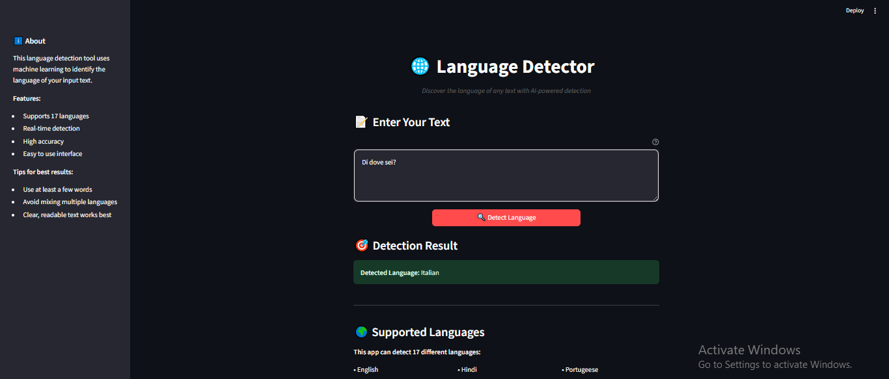
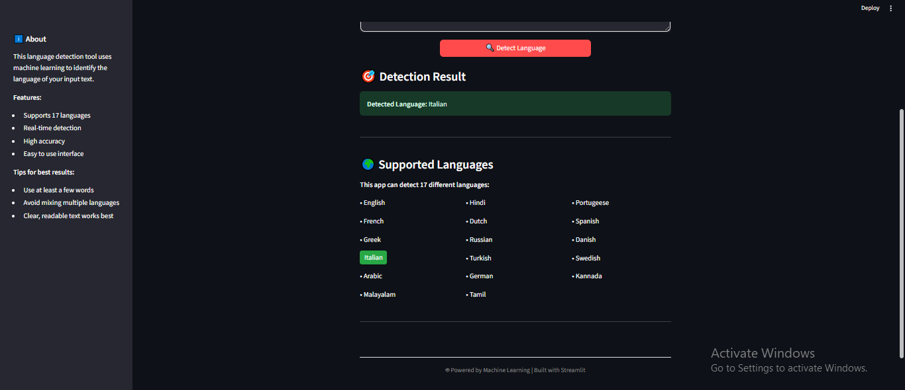

# 🌐 Language Detector

**NLP & ML-powered Language Detection App** – Detect **17 languages** from text using **character-level features** and a **Multinomial Naive Bayes model**. Built with **Scikit-learn** and **Streamlit** for an interactive UI.

## 🚀 Features

* Detects **17 different languages**: English, Hindi, French, Spanish, Portuguese, Italian, Russian, Dutch, Arabic, Turkish, German, Danish, Swedish, Greek, Tamil, Kannada, Malayalam.
* Character-level **n-gram based feature extraction**.
* **Multinomial Naive Bayes** for high accuracy.
* **Real-time detection** with Streamlit UI.
* Clean and interactive interface with info on supported languages.
* Handles **numbers, special characters**, and multiline text.

## 📱 App Preview

<div align="center">
  
  <p><em>Modern and intuitive interface for language detection</em></p>
</div>

<div align="center">
  
  <p><em>Real-time language detection with highlighted results</em></p>
</div>

## 🌐 Live Demo

Try the app live: **[Language Detector App](https://your-streamlit-app-link.streamlit.app)**

## 🗂 Folder Structure

```
language-detector/
│
├── app.py                     # Streamlit application
├── language_detection.csv      # Dataset used for training
├── language_detection.ipynb    # Jupyter notebook for model training
├── language_detector_pipeline.joblib  # Saved trained pipeline
├── requirements.txt           # Dependencies
├── assets/                     # App preview images
│   ├── preview1.png
│   └── preview2.png
```

## 💻 Installation

1. Clone the repository:

```bash
git clone https://github.com/adeel-iqbal/language-detector.git
cd language-detector
```

2. Create a virtual environment (optional but recommended):

```bash
python -m venv venv
source venv/bin/activate   # Linux / macOS
venv\Scripts\activate      # Windows
```

3. Install dependencies:

```bash
pip install -r requirements.txt
```

## 🚀 Running the App

```bash
streamlit run app.py
```

* Open the app in your browser (usually `http://localhost:8501`)
* Enter text in the input box and click **Detect Language**
* Supported languages will be displayed and the detected language will be highlighted

## 🧠 How It Works

1. **Text Preprocessing**
   * Lowercase conversion, removal of citations `[1]`, newlines, extra quotes, and extra whitespaces.

2. **Feature Extraction**
   * Character-level **n-grams (1–3)** using `CountVectorizer`.

3. **Model**
   * **Multinomial Naive Bayes** trained on 17-language dataset.

4. **Prediction**
   * Input text cleaned → transformed → predicted using trained pipeline.

## 📈 Accuracy

* Training Accuracy: ~0.987
* Testing Accuracy: ~0.985
* High accuracy across **all 17 languages**.

## ✨ Future Improvements

* Support for **short single-word detection improvement**.
* Expand to **more languages**.
* Optional **TF-IDF or neural network models** for comparison.

## 📬 Contact

* **LinkedIn:** adeeliqbalmemon
* **Email:** adeelmemon096@yahoo.com
